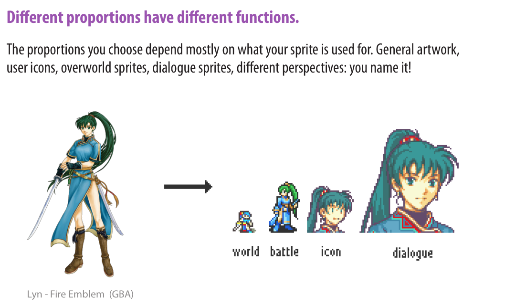
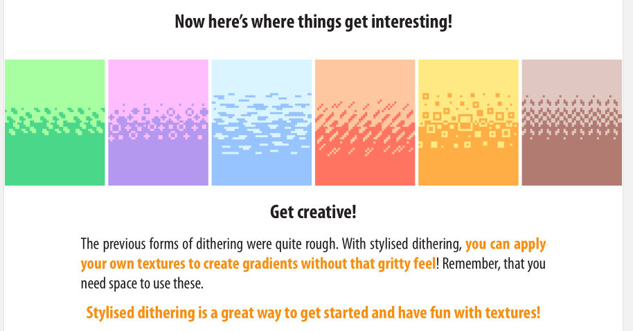
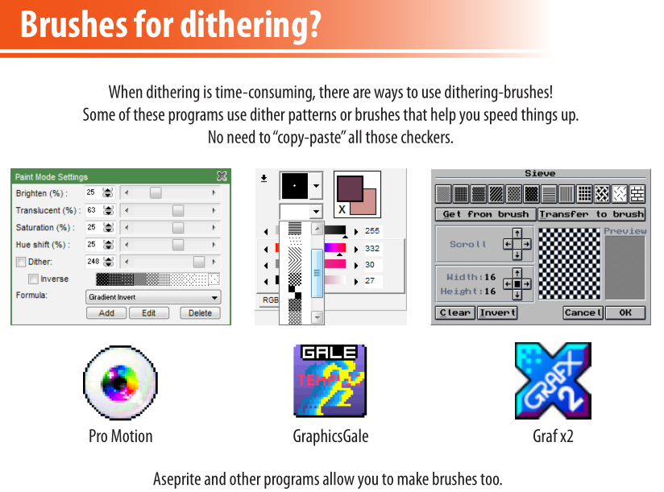

# Pixel Art

## Chapter1 Line Art 线条艺术

### Jaggle

### 线Line

#### No outline 无边框线

#### Black inline 内部也有边框线

#### Black contour 外轮廓线

#### Coloured 彩色边框线

#### Selective outline 随光源渲染的边框线

#### 总结

## Chapter 2  Anti-Aliased 反锯齿

### 什么时候用反锯齿

反锯齿常常用于平滑那些不可避免的抖动

Clarity清晰化

Detail细节化

高对比High contrast

线条粗细权重 Line weight

### 如何加反锯齿

应该是线条长度的一半，少好过多。

谨慎地使用反锯齿，少用不同的阴影，以免混淆像素艺术的边界。

### 45°的反锯齿

不常见，但是在nes一些游戏中出现过

这样就有不同的凹凸曲线的区别

### 抖动也可以通过反锯齿来进行处理

### 线重

通过颜色深浅，表示线的薄厚。

### 没必要反复反锯齿

### 绑定是不好的

### 如何修正band？

1. 从角落移出或增加一两个像素
2. 使用反锯齿

## Chapter3 colour 颜色

像素画也是电子艺术，所以他的颜色以sliders滑块来控制变量。

### 色彩定义

#### 1、The 3 Colour sliders

##### Hue 色度

##### Saturation 饱和度

##### Value 灰度值

#### 2 、RGB

### 使用调色板

### colour Ramps渐变色带

不建议在调色盘将渐变色搞混

### Hue shifting 色调偏移

#### 1、regular hue shift

黄色是色环中最亮的颜色，而紫色是最暗的，所以很多人都将色环从黄到紫

#### 2、Multiplay layers 合并颜色

### Saturation shifting 饱和度偏移

### Black tones

黑并不是单纯的黑，实际上可以在黑区加一个暗色，或是将黑区本身变成暗灰色

### 使用灰色

灰调可以“隐藏”他的存在，特别是在能用的颜色比较有限的情况下。

### 总结

## Chapter4 Readability 可读性

### Readability means Clarity(清晰)

#### Size matters...

#### but pixels matter more!

改变极小部分的像素也会让整个图片改变。

less is more。

### 用少像素表示特征

#### 手的一些小技巧

1. 先画形状，再勾勒线条
2. 像画戴手套那样，然后增加细节
3. 关注手的主体和大拇指，这两部分定义了手
4. 有时候可以只画三个手指加一个大拇指表示手
5. 使用不同的颜色区分每一根手指，主要关注阴影
6. 可以画个手，缩小它，然后用他做个参考。

#### 眼睛的一些小技巧

1. 眼睛是非常重要的部分，人们的注意力往往会关注这里
2. 但是有时候没有眼睛的空间，那么就得通过脸部阴影来制造眼部区域
3. 眼镜，尽量使其简单
4. 一些像素的区别在缩小区域之后会很不一样
5. 眼睛的处理可以有各种各样的风格，也得提高像素细节
6. 如果有需要，使用不易察觉的反锯齿

### 角色设计以及比例

### 光影

光用来强调重点，暗用来填充以及修饰边缘

最深的部分还被用来提供一种画面的纵深感，最亮的部分强调边缘以及细节。

### 空间与布局

像素不要太紧促，设计要简化精炼。

经常缩小看看整体。

### 总结

## Chapter5 Dithering 抖动

抖动是一种用有限的颜色进行混色的技术

抖动凑色是过去性能所限开发的一种技术

### 抖动是个双刃剑

太多--画面显得粗糙和颗粒状。出现一种砂砾感。

太少--大规模的没有抖色的卡通渲染渐变会显得平坦和条纹化。

### 何时使用抖色？

1. 原本会使用大量颜色来使画面自然的渐变
2. 不会动的画面
3. 纹理
4. 有很严格的颜色限制
5. 背景，各种会显得很空旷平淡的地方

### 抖色和平滑渲染的优劣

### 尽量避免双块

### 尽量避免冲突

抖色的一大原则即是大隐隐于画面。更多是起到一种过渡，而不要突出。

### 各种抖色图案

#### 方格式Checkered dithering

#### 平行线式 Parallel lines

适用于动作模糊，一般只用于有限动画，而不是在平滑动画里。

#### 不连续线式 Discontinued lines

比起平行线有更多的值和渐变层次

同时有种整洁感

#### 花边式 Dents

只有一条方格式，一般用来表示花边或者牙齿

#### 交织式 Intertwined 

一般用来对一些特别暗或亮的小部分进行上色。

#### 随机式 Random dithering

大多数情况不是很推荐。

#### 风格式 Stylised

通过自己设计的纹理来创造渐变

### 纹理和渐变并不相同

### 突破卡通渲染--像画笔一样

### 就用笔刷来dithering

### 总结

抖色如今似乎已经是过时的技术，如果你还想尝试，记住不要让他显眼突出。

## Chapter6 游戏透视

- 平面
- 坐标系
- 透视点
- 投影
- 正射投影

### 正射投影

- 横向卷轴
- 从上到下
- 顶部
- 等距的（无透视三维的）
- 45度 四边形
- 斜方

### 无透视视角 flat views

#### Side-view

在2D游戏中最常见的一种透视。应用于横版卷轴或是走廊

#### Top-down

适用于探索世界

若是真的完全遵循topdown视角，结果未必很好。

#### Top

标准的90度，很少用

### 平行线视角 Paraline views

#### 等距 Isometric view

等距下的视角，那么格子就会显示是钻石菱形。

与其用线条，不如用色块。

#### 如何在不同的角度画图形

#### 45°四角形

这种形式很少见，很高的楼可以用这种方式。

#### 斜角的Oblique

### 真实透视 True Perspective

游戏中很少用这种视角

2d游戏可以用真实的视角，但是需要很大的画面。

### 使用指导线

### 总结

你处理这个世界的视角非常重要。

## Chapter7 Clean-up 后处理

Clean-up 包括所有的精细化处理操作。