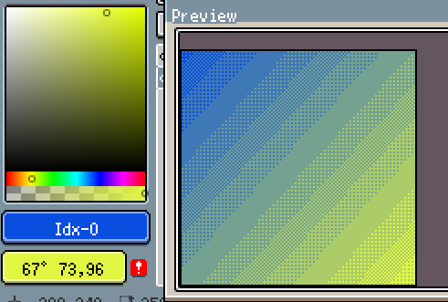

# aseprite使用教程

https://www.bilibili.com/video/BV1o7411C7zo

## 快捷键

注：在英文输入法下快捷键才有用。中文模式文件保存命名都不好搞。

| 快捷键    | 作用                                |
| --------- | ----------------------------------- |
| C         | Canvas Size 调整画布界面            |
| 鼠标滚轮  | 放大缩小画布                        |
| 空格      | 移动画布                            |
| M         | (Rectangular) Marquee Tool 选区功能 |
| B         | Pencil Tool 铅笔                    |
| Shift+B   | 喷雾工具                            |
| E         | Eraser Tool 橡皮                    |
| I         | 吸管工具                            |
| Z         | 缩放                                |
| H         | 抓手 移动整个图像                   |
| V         | 移动 只移动当前图层或选定的区域     |
| Shift + C | 切片工具                            |
| G         | 油漆桶                              |
| Shift+G   | 渐变工具                            |
| L         | 直线工具                            |
| Shift+L   | 曲线工具（贝塞尔曲线）              |
| R         | 模糊工具/混乱工具                   |
| Alt       | 在不改变当前工具下，吸管工具        |

## 界面

菜单栏

属性栏

颜色栏

图层栏

工具栏

### 工具栏

#### 选区功能 M

shift 加选

鼠标右键减选

Ctrl + D 取消选区

##### 铅笔工具 B

以一个像素点为单位（可以设置）来画

建议点选pixel-perfect 以避免jaggle

属性里可以看画笔的形状，大小，墨水，不透明度

阿尔法模式下橡皮擦不好使。

mask 透明 

##### 吸管工具Alt

##### 油漆桶G

注意contiguous，框选后会将临近的也进行填充

##### 渐变工具 Shift+G

鼠标左键颜色，起始颜色

鼠标右键颜色，结束颜色

从属性栏选择渐变方式，线性或圆形，baymatrix的阶数

##### 直线工具L

按住shift 画直线

如果想以点为中心画直线，那么按住Ctrl，也可以配合shift

##### 图形工具U

画方U

画圆Shift + U

再按一边可以切换是否填充。

可以通过属性栏改变边框的粗细。

#### 颜色栏

各种设置

按F4快速调出颜色面板

#### 图层栏

Shift+N 快速新建图层

按tab 就可以关闭和开启图层栏

右下角可以新建帧